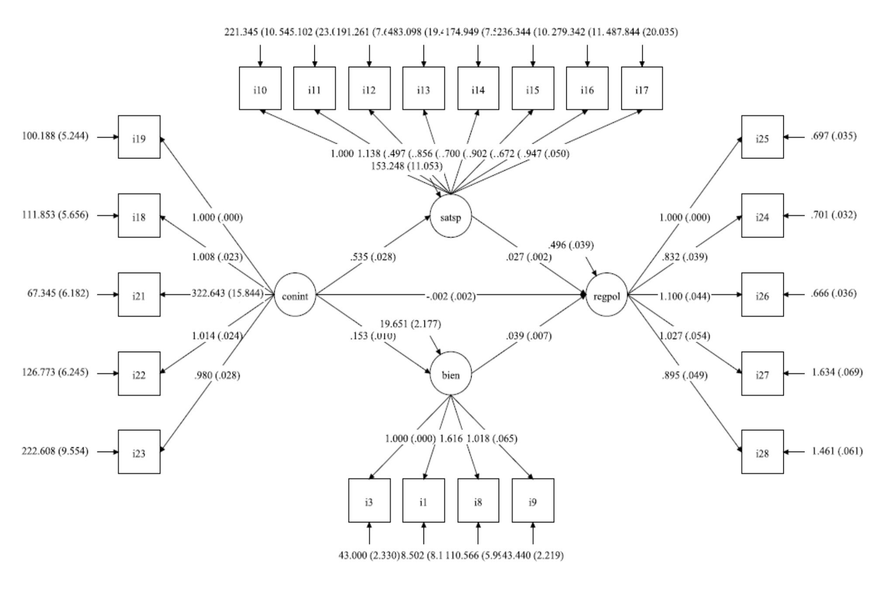

class: left, middle, bg_karl1, h1

 
## Manejo de dataframes

### Sebastián Massa Slimming 
### 8 de abril 2024

.pull-left[
 
]
.pull-right[

]


```{css, echo = F}
.bg_karl1 {
  position: relative;
  z-index: 1;
}

.bg_karl1::before {    
      content: "";
      background-image: url('https://scitechdaily.com/images/Hacking-Cybersecurity.gif');
      background-size: cover;
      position: absolute;
      top: 0px;
      right: 0px;
      bottom: 0px;
      left: 0px;
      opacity: 1;
      z-index: -1;
}

.h1 {
  color: white;
  text-shadow: 2px 2px 4px #000000;
}

```


```{r, echo = FALSE, warning = FALSE}
library(countdown)
countdown(minutes = 5, 
          left = 100, 
          right = 0,
          padding = "1px",
          margin = "1%",
          font_size = "2em")
```

---
class: right, middle, inverse, bg_karl30, h30
# Lo que nadie te dirá cuando uno empieza a programar...


```{css, echo = F}
.bg_karl30 {
  position: relative;
  z-index: 1;
}

.bg_karl30::before {    
      content: "";
      background-image: url("https://i.pinimg.com/originals/0e/5f/29/0e5f291913819eeefcea5a8a6b388afe.gif");
      background-size: cover;
      position: absolute;
      top: 0px;
      right: 0px;
      bottom: 0px;
      left: 0px;
      opacity: 1;
      z-index: -1;
}

.h30 {
  color: white;
  text-shadow: 2px 2px 4px #000000;
}

```

---

class: right, middle, inverse, bg_karl31, h31

```{css, echo = F}
.bg_karl31 {
  position: relative;
  z-index: 1;
}

.bg_karl31::before {    
      content: "";
      background-image: url("https://i.redd.it/3z88nwl2qkg61.gif");
      background-size: cover;
      position: absolute;
      top: 0px;
      right: 0px;
      bottom: 0px;
      left: 0px;
      opacity: 1;
      z-index: -1;
}

.h31 {
  color: white;
  text-shadow: 2px 2px 4px #000000;
}

```

---

class: middle, right, inverse, bg_karl41, h41
# ¡Cometeremos muchos errores en el camino! 

```{css, echo = F}
.bg_karl41 {
  position: relative;
  z-index: 1;
}

.bg_karl41::before {    
      content: "";
      background-image: url("https://i.pinimg.com/originals/41/ef/34/41ef34590ba657ae90197568c560ae34.gif");
      background-size: cover;
      position: absolute;
      top: 0px;
      right: 0px;
      bottom: 0px;
      left: 0px;
      opacity: 1;
      z-index: -1;
}

.h41 {
  color: white;
  text-shadow: 2px 2px 4px #000000;
}

```

---

class: middle, right, inverse, bg_karl42, h42
# No encontraremos las causas rápidamente 

```{css, echo = F}
.bg_karl42 {
  position: relative;
  z-index: 1;
}

.bg_karl42::before {    
      content: "";
      background-image: url("https://media.giphy.com/media/lq2u8GnHsDMTCzs5f4/giphy.gif");
      background-size: cover;
      position: absolute;
      top: 0px;
      right: 0px;
      bottom: 0px;
      left: 0px;
      opacity: 1;
      z-index: -1;
}

.h42 {
  color: white;
  text-shadow: 2px 2px 4px #000000;
}

```

---

class: middle, right, inverse, bg_karl43, h43
# Habrá rabia contra el mundo

```{css, echo = F}
.bg_karl43 {
  position: relative;
  z-index: 1;
}

.bg_karl43::before {    
      content: "";
      background-image: url("https://media.giphy.com/media/l0HlIxGxlE5AXV11m/source.gif");
      background-size: cover;
      position: absolute;
      top: 0px;
      right: 0px;
      bottom: 0px;
      left: 0px;
      opacity: 1;
      z-index: -1;
}

.h43 {
  color: white;
  text-shadow: 2px 2px 4px #000000;
}

```

---

class: middle, right, inverse, bg_karl44, h44
# Prestar atención a la lógica

```{css, echo = F}
.bg_karl44 {
  position: relative;
  z-index: 1;
}

.bg_karl44::before {    
      content: "";
      background-image: url("https://static.theclinic.cl/media/2021/11/dicaprio.gif");
      background-size: cover;
      position: absolute;
      top: 0px;
      right: 0px;
      bottom: 0px;
      left: 0px;
      opacity: 1;
      z-index: -1;
}

.h44 {
  color: white;
  text-shadow: 2px 2px 4px #000000;
}

```

---

class: middle, right, inverse, bg_karl45, h45 
# Siempre volvemos a nuestro loop infinito de Google. No inventar la rueda.

```{css, echo = F}
.bg_karl45 {
  position: relative;
  z-index: 1;
}

.bg_karl45::before {    
      content: "";
      background-image: url("https://i.redd.it/g2naxsim9do91.gif");
      background-size: cover;
      position: absolute;
      top: 0px;
      right: 0px;
      bottom: 0px;
      left: 0px;
      opacity: 1;
      z-index: -1;
}

.h45 {
  color: white;
  text-shadow: 2px 2px 4px #000000;
}

```
---

class: center, middle, bg_karl6, h6

# En las dinámicas organizacionales, la conformación de equipos multidisciplinarios es muy útil.

```{css, echo = F}

.bg_karl6 {
  position: relative;
  z-index: 1;
}

.bg_karl6::before {    
      content: "";
      background-image: url('https://www.bu.edu/files/2019/06/DataScience-Header.gif');
      background-size: cover;
      position: absolute;
      top: 0px;
      right: 0px;
      bottom: 0px;
      left: 0px;
      opacity: 0.9;
      z-index: -1;
}

.h6 {
  color: white;
  text-shadow: 2px 2px 4px #000000;
}

```

---

class: center, middle, bg_karl7, h7

# Programar es un arte. Toda persona interesada puede aprender. 

```{css, echo = F}

.bg_karl7 {
  position: relative;
  z-index: 1;
}

.bg_karl7::before {    
      content: "";
      background-image: url('https://i0.wp.com/analyticsindiamag.com/wp-content/uploads/2022/11/programming.gif?fit=1281%2C716&ssl=1');
      background-size: cover;
      position: absolute;
      top: 0px;
      right: 0px;
      bottom: 0px;
      left: 0px;
      opacity: 0.9;
      z-index: -1;
}

.h7 {
  color: white;
  text-shadow: 2px 2px 4px #000000;
}

```

---


class: center, middle, bg_karl2, h3

# Los datos necesitan de la teoría para poder ser interpretados. 

```{css, echo = F}

.bg_karl2 {
  position: relative;
  z-index: 1;
}

.bg_karl2::before {    
      content: "";
      background-image: url('https://cdn.dribbble.com/users/31818/screenshots/5054596/gif-dribb.gif');
      background-size: cover;
      position: absolute;
      top: 0px;
      right: 0px;
      bottom: 0px;
      left: 0px;
      opacity: 0.9;
      z-index: -1;
}

.h3 {
  color: white;
  text-shadow: 2px 2px 4px #000000;
}

```

---
class: left, middle
## Supuestos teóricos

1) La [**confianza institucional**]() constituye la dimensión más robusta para analizar fenómenos relativos a la calidad y satisfacción democrática en el Chile contemporáneo. Esta confianza depende tanto de la performance gubernamental (es decir, la capacidad o eficacia gubernamental) junto con la [**valoración de figuras políticas**]() (Morales, 2008). 

2) La satisfacción de la democracia dependerá de la [**valoración de los ciudadanos respecto a la capacidad**]() (es decir, eficacia) gubernamental de trasladar las preferencias en la toma de decisiones políticas
(Delgado, 2015).

3) La satisfacción con la democracia está influenciada a nivel macro con el [**ingreso de las personas**]() y a nivel micro con las [**percepciones que tiene cada individuo en su bienestar personal**](), de la situación de la economía en general, género y educación (Vargas & González, 2013).

4) La satisfacción de la democracia depende de la [**situación económica del país**](), el desempeño del gobierno y la [**confianza interpersonal**]() y política (Alister, Cea & Guerrero, 2015)

5) La satisfacción con la democracia no se encuentra directamente vinculado con la confianza social o el apego a la comunidad, aunque sí con un tercer factor en común, la [**satisfacción con la vida**]() (Montero, et al, 2008).

---


---
class: middle, right, inverse, bg_karl81, h81
# Preferencia por régimen político


```{css, echo = F}
.bg_karl81 {
  position: relative;
  z-index: 1;
}

.bg_karl81::before {    
      content: "";
      background-image: url("https://www.df.cl/noticias/site/artic/20220505/imag/foto_0000001020220505142138/A-_especial_1_-_Convencion_Constitucional_1.gif");
      background-size: cover;
      position: absolute;
      top: 0px;
      right: 0px;
      bottom: 0px;
      left: 0px;
      opacity: 1;
      z-index: -1;
}

.h81 {
  color: white;
  text-shadow: 2px 2px 4px #000000;
}

```

---

class: middle, right, inverse, bg_karl64, h64
# Clivajes ideológicos

```{css, echo = F}
.bg_karl64 {
  position: relative;
  z-index: 1;
}

.bg_karl64::before {    
      content: "";
      background-image: url("https://resizer.glanacion.com/resizer/v2/-P2VVFLAM3NHPNDNOIMWH4RTCRI.gif?auth=74dc9d0442380439ff4555b82541dd332035a5fb7c24c3c08e2acb0ac2170706&width=1920&height=1280&quality=70&smart=true");
      background-size: cover;
      position: absolute;
      top: 0px;
      right: 0px;
      bottom: 0px;
      left: 0px;
      opacity: 1;
      z-index: -1;
}

.h64 {
  color: white;
  text-shadow: 2px 2px 4px #000000;
}

```

---
class: top, right, inverse, bg_karl3, h59
# Confianza interpersonal

```{css, echo = F}
.bg_karl3 {
  position: relative;
  z-index: 1;
}

.bg_karl3::before {    
      content: "";
      background-image: url("https://www.latercera.com/resizer/0D3wm-fGR_VPy6AhCETDoX0JHgE=/800x0/smart/cloudfront-us-east-1.images.arcpublishing.com/copesa/N6PE2YJ4RJCMPN65QMI6CC34RE.gif");
      background-size: cover;
      position: absolute;
      top: 0px;
      right: 0px;
      bottom: 0px;
      left: 0px;
      opacity: 9;
      z-index: -1;
}

.h59 {
  color: black;
  text-shadow: 1px 1px 3px white;
}

```

---

class: middle, right, inverse, bg_karl59, h59
# Percepción de la economía

```{css, echo = F}
.bg_karl59 {
  position: relative;
  z-index: 1;
}

.bg_karl59::before {    
      content: "";
      background-image: url("https://www.df.cl/noticias/site/artic/20210712/imag/foto_0000000720210712192213.gif");
      background-size: cover;
      position: absolute;
      top: 0px;
      right: 0px;
      bottom: 0px;
      left: 0px;
      opacity: 1;
      z-index: -1;
}

.h59 {
  color: white;
  text-shadow: 2px 2px 4px #000000;
}

```

---

class: middle, center, bg_karl57, h57

# Evaluación de figuras políticas

```{css, echo = F}
.bg_karl57 {
  position: relative;
  z-index: 1;
}

.bg_karl57::before {    
      content: "";
      background-image: url("https://amp.df.cl/mrf4u/statics/i/ps/www.df.cl/noticias/site/artic/20220121/imag/foto_0000001520220121090529.gif?width=1200&enable=upscale");
      background-size: cover;
      position: absolute;
      top: 0px;
      right: 0px;
      bottom: 0px;
      left: 0px;
      opacity: 1;
      z-index: -1;
}

.h57 {
  color: white;
  text-shadow: 2px 2px 4px #000000;
}

```


